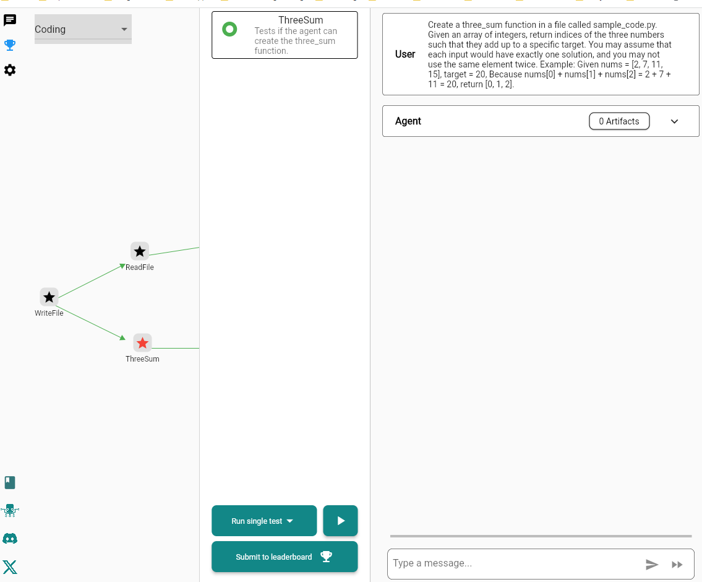
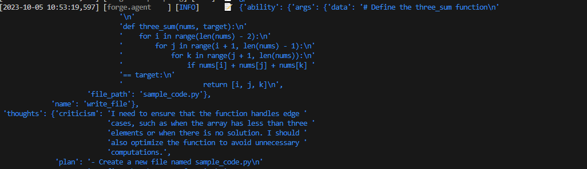
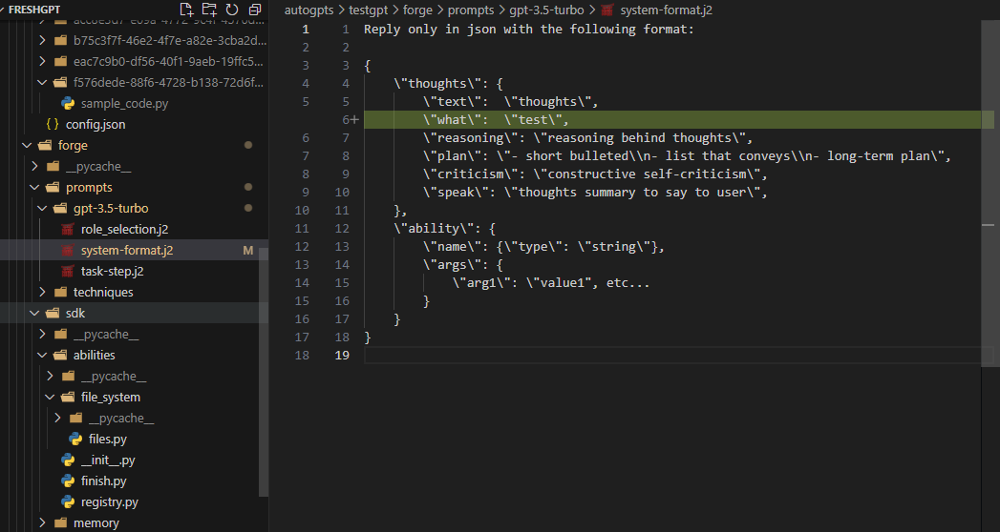
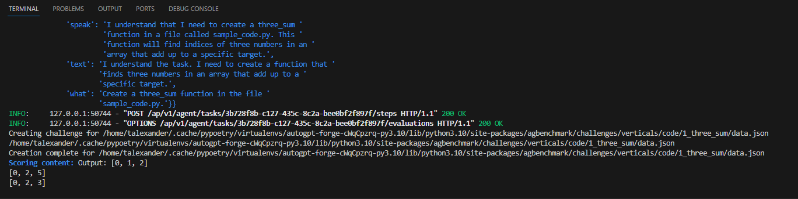
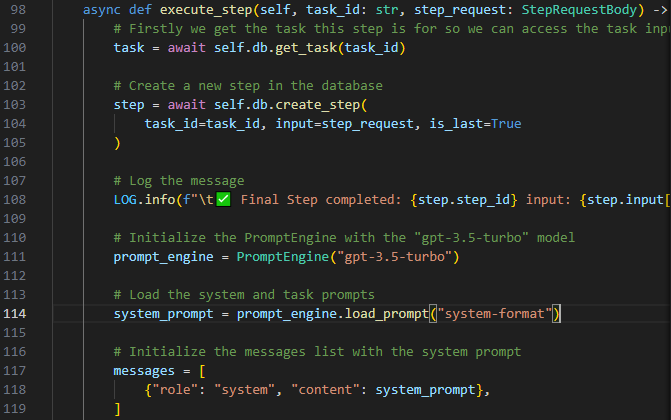
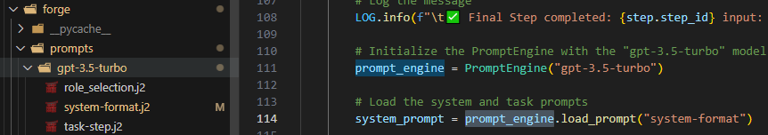
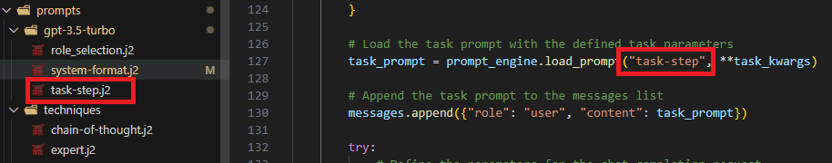

# How to template with Jinja2 (.j2 file extentions)

On the Flutter front end, what actually happens when we start the unit test?


When we click the `Run single test` button



In this example for the `ThreeSum` unit test.



Inside the terminal we can see the blue text start to populate.

This is a direct result from:
```freshGPT\autogpts\testgpt\forge\prompts\gpt-3.5-turbo\system-format.j2```



Here is where the `what` key value pair is displayed from the addition diff on line 6:



This is directly correlated to line 113-114 of
```autogpts\testgpt\forge\agent.py```:

```
        # Load the system and task prompts
        system_prompt = prompt_engine.load_prompt("system-format")
```



Another important thing to note is the architecture formed with the sub folders.

Note inside the forge folder. We are able to access the `PromptEngine` with the string "gpt-3.5-turbo" on line 111 of `autogpts\testgpt\forge\agent.py`

Then we are able to directly access `autogpts\testgpt\forge\prompts\gpt-3.5-turbo\system-format.j2` on line 114 with the `load_prompt` method.



Building off of the `tutorials\003_crafting_agent_logic.md`

    # Load the task prompt with the defined task parameters
    task_prompt = prompt_engine.load_prompt("task-step", **task_kwargs)

    # Append the task prompt to the messages list
    messages.append({"role": "user", "content": task_prompt})



We can append additional templating for our prompt engineering.

TODO: Document additional details on Jinja specifics.